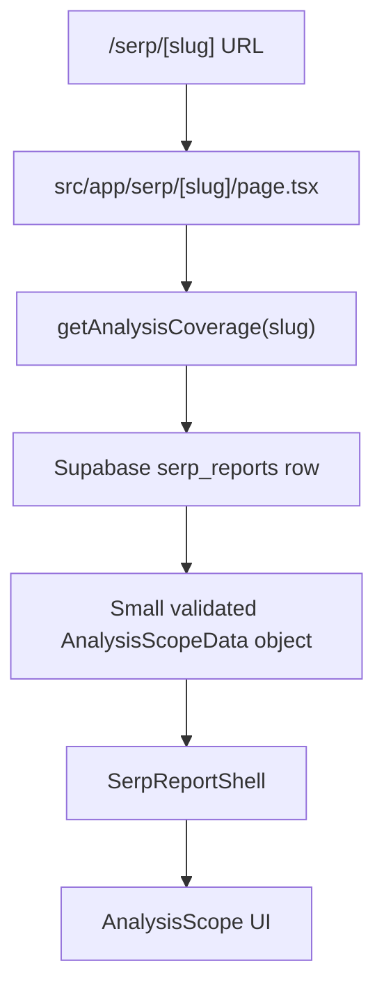

# Tavyn — Landing Page

Marketing site for Tavyn (email-first blog ops for founder-led SaaS teams). Built with the
**Next.js App Router**. This README is written so a new engineer — or an AI assistant — can
get oriented fast and know exactly where to plug in a backend. 

---

## Tech stack

|           |                                                                                                                          |
| --------- | ------------------------------------------------------------------------------------------------------------------------ |
| Framework | **Next.js 15** (App Router, React Server + Client Components)                                                            |
| Language  | **TypeScript**                                                                                                           |
| UI        | **React 19 (RC)**                                                                                                        |
| Styling   | Mostly **inline styles** driven by shared design tokens; **Tailwind 3.4** is installed and configured but used sparingly |
| Font      | **Inter** via `next/font/google`                                                                                         |
| Assets    | Static SVGs in `public/figma/` and SERP report assets in `public/serp-report/`                                           |

The waitlist API and SERP report loader both use Supabase from server-side code.

---

## Getting started

```bash
npm install
npm run dev      # dev server at http://localhost:3000
```

Scripts:

```bash
npm run dev      # start dev server
npm run build    # production build
npm run start    # run the production build
npm run lint     # eslint (next lint)
```

Node 22 is recommended; `package.json` declares `"node": "22.x"`.

---

## Routes

| Path            | File                            | What it is                                                                          |
| --------------- | ------------------------------- | ----------------------------------------------------------------------------------- |
| `/`             | `src/app/page.tsx`              | Landing page (hero + 5 workflow sections + execution gap + CTA + footer)            |
| `/waitlist`     | `src/app/waitlist/page.tsx`     | Waitlist **form** → animated **thank-you** view. **This is the main backend hook.** |
| `/faq`          | `src/app/faq/page.tsx`          | FAQ accordion                                                                       |
| `/privacy`      | `src/app/privacy/page.tsx`      | Privacy Policy                                                                      |
| `/terms`        | `src/app/terms/page.tsx`        | Terms of Service                                                                    |
| `/security`     | `src/app/security/page.tsx`     | Security                                                                            |
| `/serp/[slug]`  | `src/app/serp/[slug]/page.tsx`  | Dynamic SERP report page for a completed report row                                 |
| `/api/waitlist` | `src/app/api/waitlist/route.ts` | Server-side waitlist submission endpoint                                            |

Every "Join Waitlist" button (nav, hero, final CTA) links to `/waitlist`. "Contact" in the
footer is a `mailto:` link.

---

## Project structure

```
src/
├─ app/
│  ├─ layout.tsx          # Root layout: Inter font, sets --section-scale before first paint
│  ├─ globals.css         # Global CSS + keyframes (animations, autofill, gradient text)
│  ├─ page.tsx            # Landing page (composes the sections below)
│  ├─ api/waitlist/route.ts # Waitlist API route
│  ├─ serp/[slug]/        # Dynamic SERP report route and route states
│  ├─ waitlist/page.tsx   # Waitlist form + thank-you  ← backend hook
│  ├─ faq/page.tsx
│  ├─ privacy/page.tsx    # (privacy/terms/security all render <LegalPage/>)
│  ├─ terms/page.tsx
│  └─ security/page.tsx
├─ components/
│  ├─ tokens.ts           # ★ Design tokens: colors, gradients, dimensions, faderMask(), bgFadeGradient()
│  ├─ Section.tsx         # Wraps a section and scales it to the viewport (see Design system)
│  ├─ Nav.tsx             # Fixed top nav + the two "Join Waitlist" button variants
│  ├─ Footer.tsx          # Footer with FAQ/legal/contact links
│  ├─ LegalPage.tsx       # Shared layout for privacy/terms/security
│  ├─ StepCaption.tsx     # "More →" caption at the bottom of each step section
│  ├─ StickyWorkflowHeader.tsx  # The "One agent. Five steps." header that pins on scroll
│  ├─ sections/           # One file per landing-page section:
│  │  ├─ Hero.tsx         #   headline + inline email field + dashboard mockup
│  │  ├─ Learn.tsx  Target.tsx  Plan.tsx  Create.tsx  Ship.tsx   # the 5 workflow steps
│  │  ├─ ExecutionGap.tsx #   "Close the execution gap" feature cards
│  │  └─ Cta.tsx          #   final call-to-action (typewriter headline)
│  └─ serp-report/        # SERP report shell and report section components
├─ lib/
│  ├─ serp-report/        # Server-side report loaders and runtime schemas
│  └─ supabase/server.ts  # Server-only Supabase client helper
public/figma/             # SVG illustration assets used by the sections
public/serp-report/       # SERP report visual assets exported from Figma
```

---

## Design system (read this before editing the landing page)

The landing page and the waitlist page are **designed at a fixed 1440×780 "design canvas"**
and scaled to fit the viewport height. Understanding this is essential before moving things.

- Every landing section is wrapped in **`<Section>`** (`src/components/Section.tsx`), which
  renders a `1440×780` stage and applies `transform: scale(var(--section-scale))`.
- **`--section-scale` = `window.innerHeight / 780`.** It is set _before first paint_ by an
  inline script in `layout.tsx` (to avoid a scale flash), and updated on resize.
- **So all coordinates/sizes inside sections are in "design pixels"** (e.g. `top: 192`,
  `fontSize: 48`) — they are automatically scaled. Do not use `vw`/`vh`/`%` for section
  layout; use design px positioned absolutely, matching Figma.
- **Document pages are the exception.** `/faq`, `/privacy`, `/terms`, `/security` and the
  `Footer` are **normal scrollable pages** (NOT scaled) — they use ordinary responsive px.

**Tokens (`src/components/tokens.ts`) — always prefer these over hardcoded values:**

- `COLORS` — `bg #050506`, `card #080809`, `text #f7f8f8`, `textMuted #8a8f98`, etc.
- `BRAND_GRADIENT` / `BRAND_TEXT_GRADIENT` — the yellow→orange→red brand gradient.
  In JSX, apply gradient text with `className="brand-text-gradient"`.
- `faderMask({ top, bottom, left, right })` — returns a CSS mask that fades an element's
  edges to transparent (used to dissolve illustrations into the background).
- `bgFadeGradient(dir, hold)` — an overlay gradient that fades to the page background (used
  where a mask would clip a drop shadow, e.g. the hero dashboard).
- `DESIGN_W = 1440`, `DESIGN_H = 780`, `CTA_DESIGN_H = 537`.

Components reference their source **Figma node IDs** in comments (e.g. `Figma 300:596`) so
you can cross-check the design.

---

## SERP Report UI

This section explains the SERP report for designers who know HTML/CSS and React, but may not
work in Next.js every day.

### What the SERP report is

Each completed SERP report is available at a unique URL:

```text
/serp/[slug]
```

Local example:

```text
http://localhost:3000/serp/tavyn-seo-analysis
```

`tavyn-seo-analysis` is the report slug. A different completed row in Supabase can be loaded
by changing the slug in the URL.

### Simple rendering flow



1. A visitor opens a report URL.
2. Next.js reads the slug from the URL.
3. The server looks up the matching completed Supabase report.
4. The query retrieves only the specific JSON values required by the UI.
5. The values are converted into a small typed data object.
6. The report shell passes the required values into each design section.
7. The section renders the visual design.

Supabase is not queried directly from the browser. `SUPABASE_SECRET_KEY` is read only by
server-side modules.

### File-by-file guide

| File                                                           | What it does                                                                                                                           | Should a UX designer edit it?                                    |
| -------------------------------------------------------------- | -------------------------------------------------------------------------------------------------------------------------------------- | ---------------------------------------------------------------- |
| `src/app/serp/[slug]/page.tsx`                                 | Dynamic route page. Receives the slug, loads the report data, and renders the shell.                                                   | Usually no. Engineering/data file.                               |
| `src/app/serp/[slug]/loading.tsx`                              | Minimal Tavyn loading state while the report route is loading.                                                                         | Sometimes, for loading-state copy or visual polish.              |
| `src/app/serp/[slug]/not-found.tsx`                            | Shown when no completed report matches the slug.                                                                                       | Sometimes, for copy or visual polish.                            |
| `src/app/serp/[slug]/error.tsx`                                | Client error boundary shown if report loading fails.                                                                                   | Sometimes, for copy or visual polish.                            |
| `src/components/serp-report/SerpReportShell.tsx`               | Controls the order of report sections. Currently renders only `AnalysisScope`.                                                         | Yes, when changing section order or adding a new report section. |
| `src/components/serp-report/sections/AnalysisScope.tsx`        | React markup and visible copy for the Analysis Scope section. Builds the live metric values, subheader, funnel props, and Key Summary. | Yes. Primary UX-editing location. Keep live values in place.     |
| `src/components/serp-report/sections/AnalysisScope.module.css` | Spacing, colors, sizes, metric row, tooltips, funnel geometry, connector positions, and section visual styling.                        | Yes. Primary UX-editing location.                                |
| `src/components/serp-report/sections/MetricTooltip.tsx`        | Small client component for the metric question-mark tooltip behavior.                                                                  | Yes, for tooltip behavior only.                                  |
| `src/lib/serp-report/getAnalysisCoverage.ts`                   | Server-side Supabase query for the small Analysis Scope data object. Does not retrieve the full artifact.                              | No. Engineering/data file.                                       |
| `src/lib/serp-report/schema.ts`                                | Runtime validation for the SERP artifact shape and the narrow `AnalysisScopeData` shape.                                               | No. Engineering/data file.                                       |
| `src/lib/serp-report/getReport.ts`                             | Older full-artifact report loader. It exists in the repo but is not used by the current `/serp/[slug]` page.                           | No. Engineering/data file.                                       |
| `src/lib/supabase/server.ts`                                   | Creates the server-only Supabase client using `SUPABASE_URL` and `SUPABASE_SECRET_KEY`.                                                | No. Security-sensitive engineering file.                         |
| `public/serp-report/analysis-scope/*.svg`                      | Connector-line SVG assets exported from Figma for the Analysis Scope funnel.                                                           | Yes, if replacing exported visual assets from Figma.             |

### Component structure

```text
SERP report page
└── SerpReportShell
    └── AnalysisScope
        ├── Heading and live subheader
        ├── Live metric cards
        ├── MetricTooltip
        ├── Dynamic analysis funnel
        └── Live Key Summary
```

Only Analysis Scope exists as a report section today. Other SERP report sections are still
awaiting Figma implementation.

### What is visual and what is data-driven

Designers can safely change:

- Layout
- Spacing
- Typography
- Colors
- Borders
- Tooltip appearance
- Card appearance
- Connector-line appearance
- Animation
- Responsive behavior
- Visible wording, as long as live values remain in place

These values are live and should not be replaced with hardcoded numbers:

- `companyName`
- `queriesEvaluated`
- `queriesValidated`
- `rankingPagesAnalyzed`
- `competitorDomainsFound`
- `medianKeywordDifficulty`
- `problemQueriesValidated`
- `solutionQueriesValidated`
- `queriesDiscovered`
- `contentOpportunitiesScored`
- `contentRecommendationsSelected`
- The calculated `problemLedDemand`
- The calculated `solutionLedDemand`
- Numeric values inside the subheader and Key Summary

### Current Analysis Scope data mapping

| UI value                        | Artifact source                                                  |
| ------------------------------- | ---------------------------------------------------------------- |
| Company name                    | `serp_reports.company_name`                                      |
| Queries evaluated               | `analysis_coverage.queries_evaluated`                            |
| Relevant queries validated      | `analysis_coverage.queries_validated`                            |
| Ranking pages analyzed          | `analysis_coverage.ranking_pages_analyzed`                       |
| Competitor domains found        | `analysis_coverage.competitor_domains_found`                     |
| Median keyword difficulty       | `validated_queries.summary.median_keyword_difficulty`            |
| Problem-led demand              | Calculated from `problem_queries_validated / queries_validated`  |
| Solution-led demand             | Calculated from `solution_queries_validated / queries_validated` |
| Queries discovered              | `analysis_coverage.queries_discovered`                           |
| Content opportunities scored    | `analysis_coverage.content_opportunities_scored`                 |
| Priority opportunities selected | `analysis_coverage.content_recommendations_selected`             |

The report loader projects only these required JSON paths. It does not retrieve or send the
complete artifact to the UI.

### How the dynamic funnel works

The funnel begins with all discovered queries and narrows them through three additional
stages:

```text
Queries discovered
→ Relevant queries validated
→ Content opportunities scored
→ Priority opportunities selected
```

The adjacent colored sections represent how many queries remain or are removed between
stages:

```ts
removedBeforeValidation = queriesDiscovered - queriesValidated;

validatedButNotScored = queriesValidated - contentOpportunitiesScored;

scoredButNotSelected =
    contentOpportunitiesScored - contentRecommendationsSelected;

selected = contentRecommendationsSelected;
```

Each result is divided by `queriesDiscovered` to determine its percentage of the full bar.
The callout dots and connector lines use the same percentages, so they move when report
values change.

Do not replace these calculated widths or positions with fixed pixel values.

### How to make design changes

| Goal                          | Where to make the change                                       |
| ----------------------------- | -------------------------------------------------------------- |
| Change section wording        | `src/components/serp-report/sections/AnalysisScope.tsx`        |
| Change font size or color     | `src/components/serp-report/sections/AnalysisScope.module.css` |
| Change spacing or positioning | `src/components/serp-report/sections/AnalysisScope.module.css` |
| Change tooltip appearance     | `MetricTooltip.tsx` and `AnalysisScope.module.css`             |
| Change funnel colors          | Funnel styles in `AnalysisScope.module.css`                    |
| Change report-section order   | `src/components/serp-report/SerpReportShell.tsx`               |
| Add a new Figma section       | New section component plus `SerpReportShell`                   |
| Add a new live data value     | Supabase projection, schema, view model, and section props     |

### How to add animation safely

- Simple hover and CSS transitions can remain in the section CSS.
- An animation requiring React state, browser APIs, or an animation library should be isolated
  in a small client component.
- Do not add `"use client"` to the entire report page or report shell just to animate one
  element.
- Keep Supabase loading and data preparation on the server.
- The animation component should receive only the small values it needs through props.
- Preserve the dynamic funnel percentages when animating widths or connector positions.
- Do not install a new animation package unless the project already contains one.

### How to add the next Figma section

1. Select one frame or section in Figma.
2. Create a new component inside `src/components/serp-report/sections/`.
3. Recreate the design with placeholder content first.
4. Add the component to `SerpReportShell` in the correct order.
5. Decide which visible fields should become live.
6. Add only those exact JSON paths to the server-side Supabase projection.
7. Extend the narrow schema and view model.
8. Pass the small set of values into the new section through props.
9. Replace the placeholders without changing the design.

Each Figma frame is a section on the same `/serp/[slug]` page, not a separate route, unless
the code changes to say otherwise.

### Local setup

```bash
git clone https://github.com/tavyn-admin/tavyn-landing-page.git
cd tavyn-landing-page
git switch create-serp-magent
npm install
cp .env.example .env.local
npm run dev
```

Required environment variable names from `.env.example`:

```bash
SUPABASE_URL=
SUPABASE_SECRET_KEY=
```

Add your own Supabase values to `.env.local`. Never commit those local values.

Example local report URL:

```text
http://localhost:3000/serp/tavyn-seo-analysis
```

### Important safety notes

- Never expose `SUPABASE_SECRET_KEY` in a client component.
- Never prefix the secret key with `NEXT_PUBLIC_`.
- Never commit `.env.local`.
- Do not retrieve the complete artifact when a section needs only a few fields.
- Keep design-only changes inside the section component and its styles whenever possible.
- Do not hardcode live report numbers into the UI.

---

## Backend integrations

The project currently has two Supabase integrations: waitlist submission and SERP report
loading. Keep secret keys on the server side only.

### 1. Waitlist form (primary integration point)

**File:** `src/app/waitlist/page.tsx`

The form collects these fields in React state:

```ts
first: string; // First Name
last: string; // Last Name
email: string; // Enter email
website: string; // Company website
industry: string | null; // Industry dropdown
agreed: boolean; // "I agree to receive emails…" checkbox
company: string; // Hidden honeypot field, should stay empty
```

The form posts to `src/app/api/waitlist/route.ts`, which validates the payload and inserts a
row into Supabase. The waitlist route reads `SUPABASE_URL` and `SUPABASE_SECRET_KEY` on the
server.

### 2. Hero inline email field

**File:** `src/components/sections/Hero.tsx`

The hero has an `<input className="hero-email">` and a **Join Waitlist** button that currently
just links to `/waitlist` (the typed email is not captured). Options:

- Carry the email to the form: link to `/waitlist?email=...` and prefill `email` state there, or
- Submit directly from the hero to `/api/waitlist`.

### 3. Other CTAs & contact

- All "Join Waitlist" buttons are in `src/components/Nav.tsx` (`WaitlistButton`,
  `HeroWaitlistButton`) and link to `/waitlist`.
- Footer "Contact" is `mailto:nishchay@tavyn.dev` in `src/components/Footer.tsx` — change the
  address there.

### 4. Environment variables

`.env.example` lists the required names:

```bash
SUPABASE_URL=
SUPABASE_SECRET_KEY=
```

Add real values to `.env.local` (already gitignored). Access server-side keys only inside
Route Handlers and server modules.

---

## Updating / adding to the landing page

- **Edit an existing section:** open the matching file in `src/components/sections/`. Keep
  values in design px and pull colors/gradients from `tokens.ts`.
- **Add a new landing section:** create a component, wrap it in `<Section>` inside
  `src/app/page.tsx`. (Note: the landing page has a scroll-pinned "workflow header" and a
  step counter tied to the 5 middle sections — see `src/app/page.tsx` if you add/remove
  sections in that group.)
- **Add a new document page** (like FAQ/legal): make a normal responsive page — do NOT wrap
  it in `<Section>`. Reuse `LegalPage.tsx` for policy-style pages, and include `<Footer/>`.

---

## Notes / gotchas

- **`npm run build` / `tsc` shows ~4 type warnings in `src/components/sections/Ship.tsx`**
  about `RefObject<T | null>`. These are a known mismatch between React 19 RC and
  `@types/react` v18 and are harmless — the app builds and runs. (Fixable later by aligning
  `@types/react` to v19.)
- `--section-scale` scales by **viewport height**, so sections are sized to fit vertically;
  on very wide/narrow windows the 1440-wide canvas is centered with background gutters.
- Images are plain `` tags (not `next/image`) to keep the pixel-exact Figma layout.

---

Live repo layout is stable; the biggest single thing to know is the **1440×780 design-px +
`--section-scale`** convention, plus the split between visual section files and server-side
Supabase loaders.
